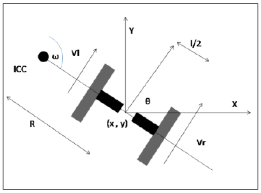
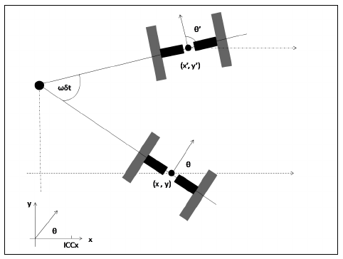
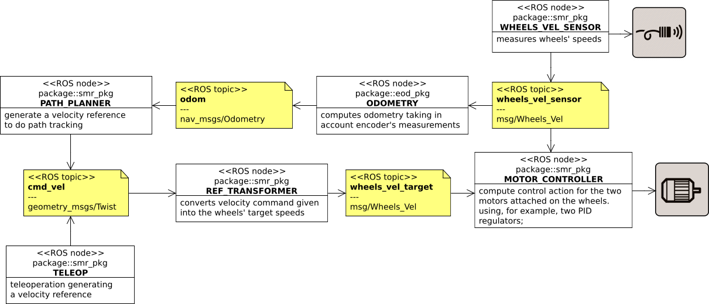

# Differential Drive
A **differential-drive robot** consists of two main wheels mounted on a common axis controlled by separete motors. One or more caster wheels are added to improve the stability of the platform. Its sterring system is nonholonomic, which means it has constraints on the pose change (is not allowed side traslations).

## Kinematics Model
**Robot kinematics** is the study of the mathematics of motion without considering the forces that affect motion. It mainly deals with the geometric relationships that govern the system.  
In general a body in the space has 6 **degrees of freedom (DOF)** expressed by the **pose** (_position + orientation_). It consists of cartesian position (_x, y, z_) and attitude (_roll, pitch, yaw_). **Roll** refers to sidewise rotation, **pitch** refers to forward and backward rotation, and **yaw** (called often _heading_ or _orientation_ for robot that moves on a plane) refers to rotation on itself (on z-axis).  
Differential-drive robot moves on the x-y plane, so is sufficient three coordinates to describe its pose; the 2D pose consists of x, y and θ, where θ is the heading of the robot, identified as the angle between the x-axis and the forward direction of the robot.  
In a differential-drive robot the motion can be controlled by adjusting the velocity of the two independently controlled motors attached on the wheels.  
**Forward kinematics equations** is used for know the pose of the robot given its velocities. The objective is determinate a discrete-time model that relates pose and velocities.  

> ![\begin{bmatrix} x_{k+1}\\\y_{k+1}\\\theta_{k+1}\end{bmatrix} = f\big( \[ x_k,\y_k,\theta_k\]^\T \big) + g\big(\[v_k,\omega_k\]^\T \big)](https://render.githubusercontent.com/render/math?math=%5Cbegin%7Bbmatrix%7D%20x_%7Bk%2B1%7D%5C%5C%5Cy_%7Bk%2B1%7D%5C%5C%5Ctheta_%7Bk%2B1%7D%5Cend%7Bbmatrix%7D%20%3D%20f%5Cbig(%20%5B%20x_k%2C%5Cy_k%2C%5Ctheta_k%5D%5E%5CT%20%5Cbig)%20%2B%20g%5Cbig(%5Bv_k%2C%5Comega_k%5D%5E%5CT%20%5Cbig))

Where  is the forward speed of the robot and  is angular velocity around the robot center point.  
Kinematic equations can be obtained from simple physical and geometric considerations. When the robot is about to perform a rolling motion, the robot must rotate around a point that lies along its common left and right wheel axes. The point that the robot rotates around is known as **Instantaneous Center of Curvature (ICC)**.  



Actuators and some kind of sensors don't work with this values, instead control the single wheel angular velocity }_k),}_k) and their linear velocities }_k), }_k). The relationship between linear and angular velocities is given by  

> 

Where  is the distance from the axis of rotation, for a wheel it's the radius.  

Assuming that there are sensors on the wheels that provide the values of the angular velocities of the wheels and from these it is possible to obtain the linear velocities.
> :vertical_traffic_light: ENCODER  
 For a rotary encoder with resolution ,  
  
where  is the numbers of ticks counted in the last time interval , so the velocities can be computed as
%7D_k%20%3D%20%5Cfrac%7B2%5Cpi%20n%5E%7B(i)%7D%7D%7BN%20%5CDelta%20t%7D%20%5Cqquad%20v%5E%7B(i)%7D_k%3D%5Cfrac%7B2%5Cpi%20r%20n%5E%7B(i)%7D%7D%7BN%20%5CDelta%20t%7D)

For the two wheels the angular velocity is the same but the distance between the ICC differs about the length of the axis :
> %7D_k%20%3D%20(R-%5Cfrac%7B%5Cell%7D%7B2%7D)%20%5Ctimes%20%5Comega_k%5C%5Cv%5E%7B(R)%7D_k%20%3D%20(R%2B%5Cfrac%7B%5Cell%7D%7B2%7D)%20%5Ctimes%20%5Comega_k%20%5Cend%7Bcases%7D)

The above system consists of 2 equation and 2 unknow factors, so is possible to obtain
> %7D_k%2Bv%5E%7B(L)%7D_k%7D%7Bv%5E%7B(R)%7D_k-v%5E%7B(L)%7D_k%7D%5Cfrac%7B%5Cell%7D%7B2%7D%5C%5C%20%5Comega_k%20%3D%20%5Cfrac%7Bv%5E%7B(R)%7D_k-v%5E%7B(L)%7D_k%7D%7B%5Cell%7D%5Cend%7Bcases%7D%20%5Cquad%20%5CLongrightarrow%20%5Cquad%20%5Cv_k%20%3D%20%5Cfrac%7Bv%5E%7B(R)%7D_k%2Bv%5E%7B(L)%7D_k%7D%7B2%7D)

To write kinematic model, first calculate the coordinates of the ICC given the pose of the robot and its velocities. It can be obtained doing simple trigonometric considerations

> %20%3D%20x_k%20-%20R%20%5C%2C%20%5Csin(%5Ctheta_k))
%20%3D%20y_k%20%2B%20R%20%5C%2C%20%5Ccos(%5Ctheta_k))



Therefore, it's possible to write the new pose of the robot after the time interval , supposing that the velocities are constant in this time.  

> %20%3D%20ICC_x%20%2B%20R%5C%2C%5Csin(%5Ctheta_%7Bk%2B1%7D)%5C%5C%20y_%7Bk%2B1%7D%20%3D%20ICC_y%20%2B%20R%5C%2C%5Csin(%5Cfrac%7B%5Cpi%7D%7B2%7D-%5Ctheta_%7Bk%2B1%7D)%20%3D%20ICC_y%20%2B%20R%5C%2C%5Ccos(%5Ctheta_%7Bk%2B1%7D)%5C%5C%20%5Ctheta_%7Bk%2B1%7D%3D%20%5Ctheta_k%20%2B%20%5Comega_k%20%5CDelta%20t%20%5Cend%7Bcases%7D)

replacing the coordinates of ICC and writing R in function of the linear and angular velocities, it's possible to write the kinematic model of the differential-drive:

> -%5Csin(%5Ctheta_k)%5Cbig)%5C%5C%20%20y_%7Bk%2B1%7D%20%3D%20y_k%20%2B%20%5Cfrac%7Bv_k%7D%7B%5Comega_k%7D%5Cbig(%5Ccos(%5Ctheta_k%2B%5Comega_k%20%5CDelta%20t)-%5Ccos(%5Ctheta_k)%5Cbig)%5C%5C%20%20%5Ctheta_%7Bk%2B1%7D%3D%20%5Ctheta_k%20%2B%20%5Comega_k%20%5CDelta%20t%20%5Cend%7Bcases%7D)

A particular case is given when , that means the robot is moving in a straight line, in this case the model become:

> %5C%5C%20%20y_%7Bk%2B1%7D%20%3D%20y_k%20%2B%20v_k%5CDelta%20t%20%5Csin(%5Ctheta_k)%5C%5C%20%20%5Ctheta_%7Bk%2B1%7D%3D%20%5Ctheta_k%20%5Cend%7Bcases%7D)

## ROS Architecture
In this section is showed an example of a simple ROS software architecture development for a differential-drive robot. The main purpose is write a set of nodes that receive actuate the wheels motors to tracking the ![\[ v_k, \omega_k\]](https://render.githubusercontent.com/render/math?math=%5B%20v_k%2C%20%5Comega_k%5D) reference velocities computed to follow a selected path.



> :bookmark: NODE COMMON STRUCTURE  
In order to improve the readability and reusability of the code it's a good practice define a standard way to implements a node for each entity which will be realized. The structure proposed plans to use a _python class_ for each node which will implemented that specifies in the ```init``` node all parameters, variables, topic, services or actions that will be used, and run at a specified rate its _life cycle_ defined in the ```loop``` function.
```python
import rospy
class NodeName:
  def __init__(self):
  rospy.init_node('node_name')
  # ------- PARAMETERS ------- 
  self.freq = rospy.get_param('freq', 10)
  self.rate = rospy.Rate(self.freq)
  # ------- VARIABLES -------
  self.var1 = ...
  self.var2 = ...
  # -------   TOPICS   -------
  rospy.Subscriber(...
  self.publisher = ...
  # -------   SERVICES   -------
  ...
  # -------   ACTIONS   -------
  ...

  # -------   LIFE CYCLE   -------
  def loop(self):
    while not rospy.is_shutdown():
      ...  # node operations
      self.rate.sleep()
	
  # -------   CALLBACK   -------
  def topic_callback(self, msg):
    ... # operations on msg coming from topic
	
  # -------   UTILITY FUNCTIONS   -------
  def fun_00(self):
    ...

# -------   INITIALIZE INSTANCE  -------
if __name__ == '__main__':
  node = NodeName()
  node.loop()
```

As a _top-down_ approach let's analyze the main components of the architecture that can be implemented in a new package for this _simple mobile robot_ (```smr_pkg```).

#### :repeat: REF_TRANSFORMER NODE
The desidered reference velocities ![\[ v_k, \omega_k\]](https://render.githubusercontent.com/render/math?math=%5B%20v_k%2C%20%5Comega_k%5D) can be computed by a classic path-following algorithm, implemented in the ```path_planner``` node, given the current pose of the robot or by a teleoperation system like a keyboard or a joystick. This reference velocities are advertise on the ```cmd_vel``` topic, publishing ```Twist``` messages contains the following data:
```
Vector3  linear
Vector3  angular
```
where ```Vector3``` is another message from the ```geometry_msgs``` package which contains 3 values
```
float64 x
float64 y
float64 z
```
For a differential drive robot only linear velocity on x-axis () and angular velocity around z-axis () are selectable, so the relation is
> twist.linear.x =   
twist.angular.z = 

The target velocities of the center of mass must be transformed in wheels rotation velocities, according to the inverse formula showing in the previous section:
> %7D_k%20%3D%5Cfrac%7B1%7D%7Br%7D%20%5Cbig(%20v_k%2B%5Cfrac%7B%5Cell%7D%7B2%7D%5Comega_k%20%5Cbig)%20%5Cqquad%20%5Comega%5E%7B(L)%7D_k%20%3D%20%5Cfrac%7B1%7D%7Br%7D%20%5Cbig(v_k-%5Cfrac%7B%5Cell%7D%7B2%7D%5Comega_k%20%5Cbig))

This transformation is performed by the ```ref_transformer``` node that is subscribed at the ```cmd_vel``` topic and publish ![\[\omega^{(R)}_k,\omega^{(L)}_k\]](https://render.githubusercontent.com/render/math?math=%5B%5Comega%5E%7B(R)%7D_k%2C%5Comega%5E%7B(L)%7D_k%5D) on the ```wheels_vel_target``` topic using a custom message that contains two float values.
```
# Wheels_Vel.msg
float32 w_R
float32 w_L
```
A naive implementation of this node is the following:
```python
#! /usr/bin/env python3
import rospy
from smr_pkg.msg import Wheels_Vel
from std_msgs.msg import Float32
from geometry_msgs.msg import Twist

class RefTransformer():
  def __init__(self):
    rospy.init_node('ref_transformer')
		
    # ------ PARAMETERS ------
    self.l = rospy.get_param('smr/physics/l') # wheels distance
    self.r = rospy.get_param('smr/physics/r') # wheels radius

    # ------ TOPICS ------
    rospy.Subscriber('cmd_vel', Twist, self.transform_callback)
    self.v_target_pub = rospy.Publisher('wheels_vel_target', Wheels_Vel, queue_size=1)
		
  def loop(self):
    rospy.spin()

  def transform_callback(self, msg):
    v_k = msg.linear.x
    w_k = msg.angular.z

    w_R = (1/self.r) * (v_k + (self.l/2) * w_k)
    w_L = (1/self.r) * (v_k - (self.l/2) * w_k)
	
    msg_vel = Wheels_Vel()
    msg_vel.w_R = w_R
    msg_vel.w_L = w_L
    self.v_target_pub.publish(msg_vel)

if __name__ == '__main__':
  rt = RefTransformer()
  rt.loop()
```

#### :steam_locomotive: MOTOR_CONTROLLER NODE
The ```motor_controller``` node reads the target velocities for the wheels on the previous topic and the current wheels velocity from ```wheels_vel_sensor``` topic. With this information it calculates the control signals and send them as input to the motors. The life-cycle of this node is performed each sample time ```Ts``` and implements a classic control algorithm. The following node is implemented supposing that is using a _Raspberry_ and ```gpiozero``` library for command 12V DC motor with _H-bridge_ controller.
```python
#! /usr/bin/env python3
import rospy
from smr_pkg.msg import Wheels_Vel
from smr_pkg.lib.PID_Sat_controller import PID_Saturation
import RPi.GPIO as GPIO
from gpiozero import Motor

class MotorController():
  def __init__(self):
    rospy.init_node('motor_controller')
		
    # ------ PARAMETERS ------
    self.Ts = rospy.get_param('/smr/control/Ts', 10)
    self.rate = rospy.Rate(self.Ts)
        
    Kp = rospy.get_param('/smr/control/Kp')
    Ki = rospy.get_param('/smr/control/Ki')
    Kd = rospy.get_param('/smr/control/Kd', 0)
    u_max = rospy.get_param('/smr/control/u_max', 12)
        
    self.N = rospy.get_param('/smr/sensor/buffer_len', 10)

    # Motors pin using Raspberry
    GPIO.setmode(GPIO.BCM)
    pin_forward_R = rospy.get_param('/smr/motor/FPR')
    pin_backward_R = rospy.get_param('/smr/motor/BPR')
    pin_forward_L = rospy.get_param('/smr/motor/FPL')
    pin_backward_L = rospy.get_param('/smr/motor/BPL')

    # ------ VARIABLES ------
    self.pid_R = PID_Saturation(Kp,Ki,Kd,u_max)
    self.pid_L = PID_Saturation(Kp,Ki,Kd,u_max)

    self.motor_R = Motor(self.pin_forward_R, self.pin_backward_R, True)
    self.motor_L = Motor(self.pin_forward_L, self.pin_backward_L, True)

    self.buffer_R = []
    self.buffer_L = []
    self.w_R_meas = 0
    self.w_L_meas = 0
    self.w_R_ref = 0
    self.w_L_ref = 0

		# ------ TOPICS ------
    rospy.Subscriber('wheels_vel_target', Wheels_Vel, self.reference_callback)
    rospy.Subscriber('wheels_vel_sensor', Wheels_Vel, self.measurement_callback)
		
  def loop(self):
    while not rospy.is_shutdown():
      u_R = self.pid_R.compute(self.w_R_meas, self.w_R_ref, self.Ts)
      u_L = self.pid_L.compute(self.w_L_meas, self.w_L_ref, self.Ts)
            
      __actuate_motors(u_R,u_L)
            
      self.rate.sleep()

  def reference_callback(self, msg):
    self.w_R_ref = msg.w_R
    self.w_L_ref = msg.w_L

  def measurement_callback(self, msg):
    if len(self.buffer_R) = self.N:
      self.buffer_R.pop(0)
      self.buffer_R.append(msg.w_R)
        
    if len(self.buffer_L) = self.N:
      self.buffer_L.pop(0)
      self.buffer_L.append(msg.w_L)
        
      self.w_R_meas = sum(self.buffer_R)/len(self.buffer_R)
      self.w_L_meas = sum(self.buffer_L)/len(self.buffer_L)

  def __actuate_motors(self, u_R, u_L):
    if u_R >= 0:
      self.motor_R.forward(u_R)
    else:
      self.motor_R.backward(abs(u_R))
    if u_L >= 0:
      self.motor_L.forward(u_L)
    else:
      self.motor_L.backward(abs(u_L))
            
if __name__ == '__main__':
  mc = MotorController()
  mc.loop()
```

#### :round_pushpin: WHEELS_VEL_SENSOR NODE
The ```wheels_vel_sensor``` node comunicate with the rotary encoders on the two wheels and provide the instant angular velocities for each wheel at a fixed rate. A naive implementation of the node is proposed, supposing that is used 2 channel rotary encoder with resolution .
```python
#! /usr/bin/env python3
import rospy
from smr_pkg.msg import Wheels_Vel
import RPi.GPIO as GPIO
import math
import threading

class WheelsVelSensor():
  def __init__(self):
    rospy.init_node('wheels_vel_sensor')
		
    # ------ PARAMETERS ------
    self.f = rospy.get_param('/smr/sensor/freq', 20)
    self.rate = rospy.Rate(self.f)

    self.l = rospy.get_param('smr/physics/l') # wheels distance
    self.r = rospy.get_param('smr/physics/r') # wheels radius
    N = rospy.get_param('smr/sensor/enc_N') # encoder resolution
    self.step = 2*math.pi/N

    # Encoders pin using Raspberry
    GPIO.setmode(GPIO.BCM)
    self.pin_channel_A_R = rospy.get_param('/smr/sensor/CAR')
    self.pin_channel_B_R = rospy.get_param('/smr/sensor/CBR')
    self.pin_channel_A_L = rospy.get_param('/smr/sensor/CAL')
    self.pin_channel_B_L = rospy.get_param('/smr/sensor/CBL')
    GPIO.setup(self.pin_channel_A_R, GPIO.IN, pull_up_down = GPIO.PUD_DOWN)
    GPIO.setup(self.pin_channel_B_R, GPIO.IN, pull_up_down = GPIO.PUD_DOWN)
    GPIO.add_event_detect(self.pin_channel_A_R, GPIO.RISING, callback=callback_enc_R)
    GPIO.setup(self.pin_channel_A_L, GPIO.IN, pull_up_down = GPIO.PUD_DOWN)
    GPIO.setup(self.pin_channel_B_L, GPIO.IN, pull_up_down = GPIO.PUD_DOWN)
    GPIO.add_event_detect(self.pin_channel_A_L, GPIO.RISING, callback=callback_enc_L)

    self.lock = threading.Lock()

    # ------ VARIABLES ------
    self.ticks_R = 0
    self.ticks_L = 0
    self.prev_ticks_R = 0
    self.prev_ticks_L = 0

    # ------ TOPICS ------
    self.v_sensor_pub = rospy.Publisher('wheels_vel_sensor', Wheels_Vel, queue_size=10)

  def loop(self):
    msg_vel = Wheels_Vel()
    while not rospy.is_shutdown():
      with self.lock:
        msg_vel.w_R = (self.ticks_R-self.prev_ticks_R)*self.step*self.f
        msg_vel.w_L = (self.ticks_L-self.prev_ticks_L)*self.step*self.f
        self.prev_ticks_R = self.ticks_R
        self.prev_ticks_L = self.ticks_L
      self.v_sensor_pub.publish(msg_vel)
      self.rate.sleep()

def callback_enc_R(ch):
  global wvs
  with wvs.lock
    # Rising-edge detected on channel A
    if GPIO.input(wvs.pin_channel_B_R) == 1 
      wvs.ticks_R += 1
    else # GPIO.input(wvs.pin_channel_B_R) == 0
      wvs.ticks_R -= 1

def callback_enc_R(ch):
  global wvs
  with wvs.lock
    # Rising-edge detected on channel A
    if GPIO.input(wvs.pin_channel_B_R) == 1 
      wvs.ticks_R += 1
    else # GPIO.input(wvs.pin_channel_B_R) == 0
      wvs.ticks_R -= 1

if __name__ == '__main__':
  wvs = WheelsVelSensor()
  wvs.loop()
```

#### :curly_loop: ODOMETRY NODE
The odometry is the process needed to obtain the pose of the mobile robot in the world for applying feedback algorithm. Incremental encoders measure the rotation of the wheels, but not directly the position and orientation of the vehicle with respect to a fixed world frame. It is therefore necessary to devise a localization procedure that estimates in real-time the robot configuration. This computation is performed using the kinematic equations that models the differential-drive robot.  
Therefore the ```odometry``` node read wheels velocities information from the ```wheels_vel_sensor``` topic and calculate an estimation of the current pose of the robot and advertise it using an ```Odometry``` message from ```nav_msgs``` ROS package. 

#### :chart_with_upwards_trend: PATH_PLANNER NODE
A ```path_planner``` entity mainly consists of an algorithm that receives a target point and calculate the velocities references to reach the goal. The path planning can be use sofisticated algorithm based on different techniques or euristic algorithm. For example a simple control scheme can be divided such as 
- rotate on it-self until the orientation is on the line that connect the current point and the target
- move in straight line until the goal is reached
- rotate on it-self until the target orientation is reached

#### :video_game: TELEOP NODE
Teleopration can be performed using any control such as keyboard, joystick, radio-transmitter, etc. The purpose of this node is genereate ```Twist``` messages on the ```cmd_vel``` topic. ROS provides a lot of already implemented solution for many purpose, for keyboard teleoperation it's possible to use any of the following node ```teleop_twist_keyboard```, ```turtlebot3_teleop_key``` or develop an own code. An example of teleoperation code, that works for _root installation_ of ROS is the following:
```python
#!/usr/bin/env python3
import rospy
import time
import keyboard
from geometry_msgs.msg import Twist

class Teleop:
  def __init__(self):
    rospy.init_node('teleop_node')

  # ------- PARAMETERS -------
  self.f = rospy.get_param('/smr/control/Ts', 10)
  self.rate = rospy.Rate(self.f)
  # Velocities bounds
  self.v_max = rospy.get_param('/smr/physics/v_max', 0.2)
  self.v_min = rospy.get_param('/smr/physics/v_min', 0.01)
  self.w_max = rospy.get_param('/smr/physics/w_max', 3)
  self.w_min = rospy.get_param('/smr/physics/w_min', 0.7)
  self.v_step = rospy.get_param('/smr/physics/v_step', 10)
		
  # ------- VARIABLES ------- 
  self.cmd = Twist()
  self.cmd.linear.x = 0.0
  self.cmd.angular.z = 0.0

  # -------   TOPICS   -------
  self.cmd_vel_pub = rospy.Publisher('cmd_vel', Twist, queue_size = 1)

  def loop(self):
    while not rospy.is_shutdown():
      # Detect new command
      if keyboard.is_pressed('up'):
        self.cmd.linear.x = min([self.cmd.linear.x + (self.v_max - self.v_min)/self.v_step, self.v_max])
      elif keyboard.is_pressed('down'):
        self.cmd.linear.x = max([self.cmd.linear.x - (self.v_max - self.v_min)/self.v_step, -self.v_max])
      else:
        self.cmd.linear.x = 0.0
      if keyboard.is_pressed('left'):
        self.cmd.angular.z = min([self.cmd.angular.z + (self.w_max - self.w_min)/self.v_step, self.w_max])
      elif keyboard.is_pressed('right'):
        self.cmd.angular.z = max([self.cmd.angular.z - (self.w_max - self.w_min)/self.v_step, -self.w_max])
      else:
        self.cmd.angular.z = 0.0
				
      self.cmd_vel_pub.publish(self.cmd)
      self.rate.sleep()

if __name__ == '__main__':
  t = Teleop()
  t.loop()
```
